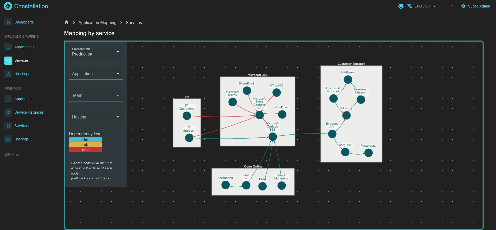
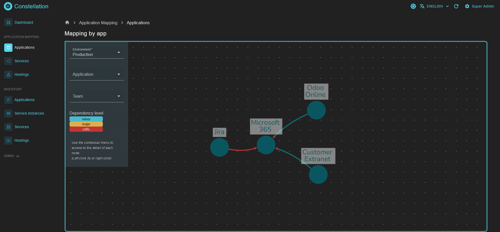

<div id="top"></div>
<!--
*** Thanks for checking out the Best-README-Template. If you have a suggestion
*** that would make this better, please fork the repo and create a pull request
*** or simply open an issue with the tag "enhancement".
*** Don't forget to give the project a star!
*** Thanks again! Now go create something AMAZING! :D
-->


<!-- PROJECT SHIELDS -->
<!--
*** I'm using markdown "reference style" links for readability.
*** Reference links are enclosed in brackets [ ] instead of parentheses ( ).
*** See the bottom of this document for the declaration of the reference variables
*** for contributors-url, forks-url, etc. This is an optional, concise syntax you may use.
*** https://www.markdownguide.org/basic-syntax/#reference-style-links
-->
[](https://gitlab.com/abolabs/constellation/commits/master)
[](https://gitlab.com/abolabs/constellation/commits/master)
[](https://gitlab.com/gitlab-org/gitlab-runner)
[](https://gitlab.com/abolabs/constellation)
 [](https://www.gnu.org/licenses/agpl-3.0)


<!-- PROJECT LOGO -->
<br />
<div align="center">
  <a href="https://gitlab.com/abolabs/constellation">
    
  </a>

  <h3 align="center">Constellation</h3>

  <p align="center">
    Application mapping interface
    <br />
    <a href="README.md"><strong>French version »</strong></a>
    <br />
    <br />        
    <a href="https://gitlab.com/abolabs/constellation/-/issues">Report a Bug</a>
    ·
    <a href="https://gitlab.com/abolabs/constellation/-/issues">Request Feature</a>
  </p>
</div>


<!-- TABLE OF CONTENTS -->
<details>
  <summary>Table of Contents</summary>
  <ol>
    <li>
      <a href="#about-the-project">About The Project</a>
      <ul>
        <li><a href="#built-with">Built With</a></li>
      </ul>
    </li>
    <li>
      <a href="#getting-started">Getting Started</a>
      <ul>
        <li><a href="#prerequisites">Prerequisites</a></li>
        <li><a href="#installation">Installation</a></li>
      </ul>
    </li>
    <li><a href="#usage">Usage</a></li>    
    <li><a href="#contributing">Contributing</a></li>
    <li><a href="#license">License</a></li>
    <li><a href="#contact">Contact</a></li>    
  </ol>
</details>


<!-- ABOUT THE PROJECT -->
## About The Project

Constellation is an application mapping interface allowing any IT structure to view and control its dependencies by service. 

### Features

* Modeling of applications and application services
* Service management by version
* Declaration of service dependencies according to 3 levels:
    * **Minor** 
    In the event of unavailability: impact on minor or major functionality (s) with workaround
    * **Major** 
    In the event of unavailability: impact on major feature (s) without workaround but without general unavailability
    * **Critical** 
    In the event of unavailability: impact of major functionality (s) without a workaround resulting in general unavailability of the application



* **3 types of visualizations possible** 
    * Dependencies between applications
    * Service dependencies by application
    * Service dependencies by hosting solutions


<p align="right">(<a href="#top">back to top</a>)</p>


### Built With

The solution was intentionally implemented with easy-to-access solutions, allowing as many people as possible to take ownership of the project.

This section lists the main libraries and frameworks used during the development of the solution:

* [Laravel](https://laravel.com)
* [Bootstrap](https://getbootstrap.com)
* [CoreUI](https://coreui.io/)
* [InfyOm](https://infyom.com/open-source)
* [Cytoscape](https://js.cytoscape.org/)

<p align="right">(<a href="#top">back to top</a>)</p>

<!-- GETTING STARTED -->
## Getting Started

The instructions below show the different steps to initialize the application via Docker.

### Prerequisites

The app has been developed using the versions below:

* Docker version 20.10.9, build c2ea9bc
* docker-compose version 1.29.2, build 5becea4c

The versions of services used are declared in the file `./install/dev/docker-compose.yml`. 

### Installation

#### 1. Initialize the docker-compose environment file

```sh
cp ./install/prod/.env.example .env
``` 

#### 2. Edit the Docker stack environment file

* `MYUSER` Username in the api container.
* `DATA_VOLUME` Sharing directory for storing service data (Mariadb, Nginx, Redis).
* `SOURCE_VOLUME` Location of application sources (ex.: `/home/myname/project/Constellation`).
* Mariadb - The information below must match that of the `.env` Laravel file, at the root of the project).
    * `MARIADB_ROOT_PASSWORD` Root user Mariadb password
    * `MYSQL_USER` Mariadb username.
    * `MYSQL_PWD` Mot de passe.
    * `MYSQL_PORT` Port Mariadb shared with the Docker host.
    * `MYSQL_DATABASE` Database name initialized by default.
* MailDev - Service de debug pour l'envoi de mail.
_(see https://hub.docker.com/r/maildev/maildev)_
    * `SMTP` Port shared with the host for listening to messages to be captured.
    * `WEBUI` Port shared with the host to access the email display interface.

#### 3. Build the stack    

```sh
docker-compose up -d
```
All services should go up, allowing you to move on to initializing the application.
If not, check the information entered in the `./install/dev/.env` file.
If the ports are already in use by other services, change the configuration.

#### 4. Application initialization

* Initialize the Laravel environment file
    ```sh
    cp .env.example .env
    ```
* Edit the Laravel environment file.
    * Generate a new application key (it is not recommended to use the one used for building the Docker image).
    `docker-compose exec api php artisan key:generate`
    * Edit variables starting `DB_` to match what has been defined in the file `./install/dev/.env`.
    `docker-compose exec api nano .env`
    You can also modify the other variables according to your environment (see https://laravel.com/docs/8.x/configuration).

* Initialize the database
    * Edit the administrator. 
    Edit file `./database/seeders/CreateAdminUserSeeder.php`.
    `docker-compose exec api nano database/seeders/CreateAdminUserSeeder.php`
    Edit the name, email and password at your convenience 
    ```php
    'name' => 'Super Admin',
    'email' => 'admin@localhost',
    'password' => bcrypt('super_secured_password')
    ```
    * Initialization of tables
    ```sh
    docker-compose exec api php artisan migrate --seed
    ```
    * (Optional) Load example applications
    ```sh
    docker-compose exec api php artisan db:seed --class=AppExampleSeeder
    ```
#### 5. Finalization

Well done, you have just finished installing the solution.
You can now log in the interface.
With the default configuration, the application will be accessible locally from the following url: http://localhost:8080

<p align="right">(<a href="#top">back to top</a>)</p>


<!-- USAGE EXAMPLES -->
## Usage

Examples of uses
### Visualization of application dependencies



### Viewing service dependencies by application


### Visualization of service dependencies by hosting solution


<p align="right">(<a href="#top">back to top</a>)</p>


<!-- CONTRIBUTING -->
## Contributing

Contributions are what make the open source community such an amazing place to learn, inspire, and create. Any contributions you make are **greatly appreciated**.

If you have a suggestion that would make this better, please fork the repo and create a pull request. You can also simply open an issue with the tag "enhancement".
Don't forget to give the project a star! Thanks again!

1. Fork the Project
2. Create your Feature Branch (`git checkout -b feature/AmazingFeature`)
3. Commit your Changes (`git commit -m 'Add some AmazingFeature'`)
4. Push to the Branch (`git push origin feature/AmazingFeature`)
5. Open a Pull Request

<p align="right">(<a href="#top">back to top</a>)</p>


<!-- LICENSE -->
## License

Distributed under GNU AFFERO GENERAL PUBLIC LICENSE. See `LICENSE` for more information.

<p align="right">(<a href="#top">back to top</a>)</p>


<!-- CONTACT -->
## Contact

### Contributor(s)

(Creator) Alexandre Bordin - [@Linkedin](https://www.linkedin.com/in/alexandre-bordin/)


Project Link: [https://gitlab.com/abolabs/constellation](https://gitlab.com/abolabs/constellation)

<p align="right">(<a href="#top">back to top</a>)</p>

