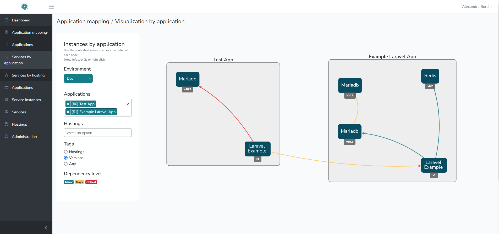
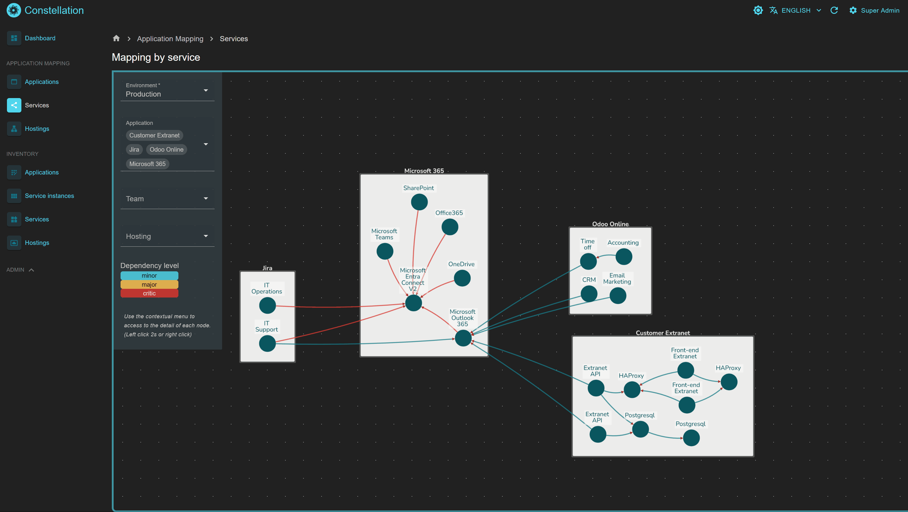
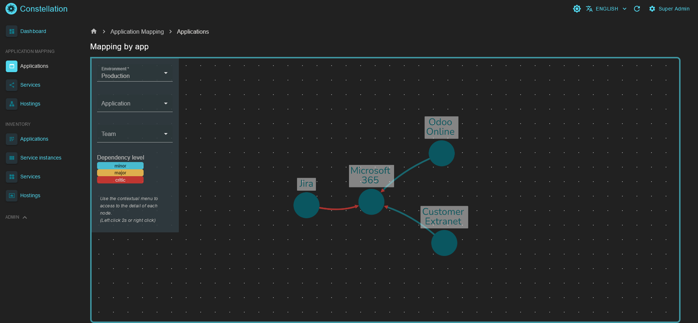

<!--
*** Thanks for checking out the Best-README-Template. If you have a suggestion
*** that would make this better, please fork the repo and create a pull request
*** or simply open an issue with the tag "enhancement".
*** Don't forget to give the project a star!
*** Thanks again! Now go create something AMAZING! :D
-->

<!-- PROJECT SHIELDS -->
<!--
*** I'm using markdown "reference style" links for readability.
*** Reference links are enclosed in brackets [ ] instead of parentheses ( ).
*** See the bottom of this document for the declaration of the reference variables
*** for contributors-url, forks-url, etc. This is an optional, concise syntax you may use.
*** https://www.markdownguide.org/basic-syntax/#reference-style-links
-->

<!-- PROJECT LOGO -->
 

  

  <h3 align="center">Constellation</h3>

  

    IT service mapping interface
     
     
    <a href="https://gitlab.com/abolabs/constellation/-/issues">Report a Bug</a>
    ·
    <a href="https://gitlab.com/abolabs/constellation/-/issues">Request Feature</a>
  

<!-- TABLE OF CONTENTS -->

  
Table of Contents

  <ol>
    <li>
      <a href="#about-the-project">About The Project</a>
      <ul>
        <li><a href="#main-features">Main features</a></li>
      </ul>
      <ul>
        <li><a href="#hammer-built-with">Built With</a></li>
      </ul>
    </li>
    <li>
      <a href="#getting-started">Getting Started</a>
      <ul>
        <li><a href="#prerequisites">Prerequisites</a></li>
        <li><a href="#setup">Setup</a></li>
      </ul>
    </li>
    <li><a href="#usage">Usage</a></li>
    <li><a href="#contributing">Contributing</a></li>
    <li><a href="#license">License</a></li>
    <li><a href="#contact">Contact</a></li>
  </ol>

<!-- ABOUT THE PROJECT -->

## About The Project

Constellation is an IT service mapping interface, enabling any IT organization to visualize and control its dependencies by application.

- Online demo: https://constellation.abolabs.fr/ (login: `demo@abolabs.fr`/ password: `demo`)

### Main features

- Modeling of applications and application services.
- Service management by version.
- Declaration of service dependencies according to 3 levels:
  - :large_blue_circle: **Minor**
    In the event of unavailability: impact on minor or major functionality(ies) with workaround solution.
  - :large_orange_diamond: **Major**
    In the event of unavailability: impact on major function(s) with no workaround but no general unavailability.
  - :red_circle: **Critical**
    In the event of unavailability: impact of one (or more) major function(s) with no workaround, resulting in general unavailability of the application.

- **3 types of visualization possible**

  - Dependencies between applications
  - Service dependencies by application
  - Service dependencies by hosting solutions

- **Impact detection**

(<a href="#top">back to top</a>)

### :hammer: Built With

#### API

- [Laravel](https://laravel.com)
- [MariaDB](https://mariadb.org/)
- [Meilisearch](https://www.meilisearch.com/)
- [Redis](https://redis.io/)

#### Web UI

- [React](https://react.dev) with [ReactAdmin](https://marmelab.com/react-admin/)
- [Cytoscape](https://js.cytoscape.org/)

(<a href="#top">back to top</a>)

<!-- GETTING STARTED -->

## Getting Started

The instructions below show the various steps involved in initializing the application via Docker.

### Prerequisites

The app has been developed using the versions below:

- Docker version `21.0.6`, build `ed223bc`.
- Docker compose v2:
  - That means all commands with be executed with `docker compose ...` instead of `docker-compose ...`.
  - See [migration guide](https://docs.docker.com/compose/migrate/) to upgrade to v2.

Each service version is declared in the file `./install/dev/docker-compose.yml`.

### Setup

Step-by-step installation instructions are available in [./doc/Setup.md](./doc/Setup.md).

<!-- USAGE EXAMPLES -->

## Usage

Examples of uses

### Visualizing application dependencies

### Viewing service dependencies by application

### Visualization of service dependencies by hosting solution

(<a href="#top">back to top</a>)

<!-- CONTRIBUTING -->

## Contributing

Contributions are what make the open source community such an amazing place to learn, inspire, and create. Any contributions you make are **greatly appreciated**.

If you have a suggestion that would make this better, please fork the repo and create a pull request. You can also simply open an issue with the tag "enhancement".
Don't forget to give the project a star! Thanks again!

1. Fork the Project
2. Create your Feature Branch (`git checkout -b feature/AmazingFeature`)
3. Commit your Changes (`git commit -m 'Add some AmazingFeature'`)
4. Push to the Branch (`git push origin feature/AmazingFeature`)
5. Open a Pull Request

(<a href="#top">back to top</a>)

<!-- LICENSE -->

## License

Distributed under GNU AFFERO GENERAL PUBLIC LICENSE. See [`LICENSE`](./LICENSE) for more information.

(<a href="#top">back to top</a>)

<!-- CONTACT -->

## Contact

### Contributor(s)

(Creator) Alexandre Bordin - [@Linkedin](https://www.linkedin.com/in/alexandre-bordin/)

Project Link: [https://gitlab.com/abolabs/constellation](https://gitlab.com/abolabs/constellation)

(<a href="#top">back to top</a>)

